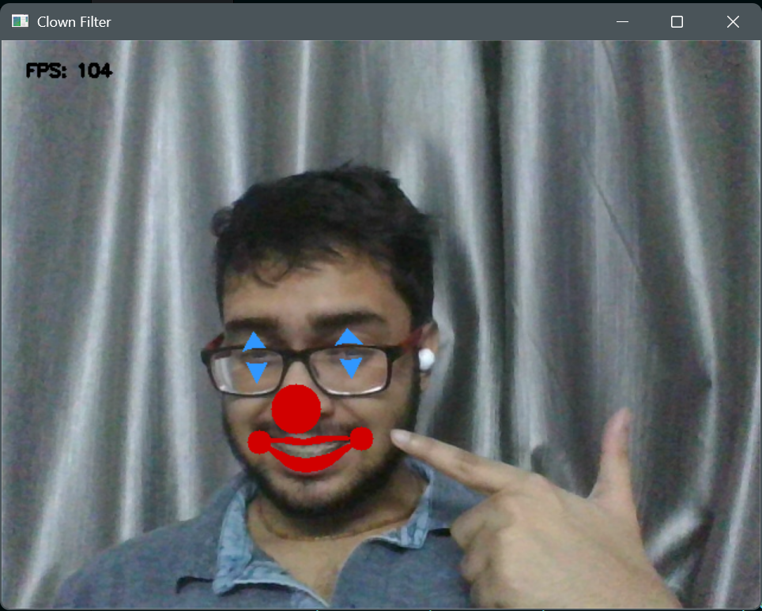

# 🤡 Real-Time Clown Face Filter
Turn any boring face into a circus-level masterpiece — in real-time!
This project uses OpenCV + Mediapipe Face Mesh to track your facial landmarks and slap on a clown nose, funny lips, and cartoonish makeup 🎨.

## 🎪 Features
🟥 Clown Nose – Big red circle right on target (no honking sound yet, sorry).  
👄 Clown Lips – Perfectly over-exaggerated lipstick… way better than real life.  
👀 Crazy Eyes – Adds silly shapes around your eyes to give you that “just joined the circus” look.  
⚡ Real-time filter – Works live with your webcam.  
🤖 Powered by Python + Mediapipe + OpenCV.  

## 🛠 Installation
Clone the repo 
```  
git clone https://github.com/SANGEET240/Clown-Face-Filter-.git
```

## Move into the folder
```
cd clown-face-filter
```

## Create virtual environment (optional but recommended)
```python -m venv venv```  
```source venv/bin/activate```   # Linux/Mac  
```venv\Scripts\activate```      # Windows  

## Install dependencies
```pip install -r requirements.txt```

## 🚀 Usage
Run the filter:
python clown_filter.py  
Press **ESC** to exit.

## 😂 Demo
Here’s what you’ll look like:  


## 📂 Project Structure
📁 clown-face-filter   
│── clown_filter.py        
│── FaceMeshModule.py          
│── requirements.txt     
│── README.md            
│  
├── 📁 Demo_Face          
│   └── MyFaceDemo.png           

## ⚠️ Disclaimer
This project may:
Cause uncontrollable laughter.
Get you kicked out of serious Zoom meetings.
Make you reconsider your career choices.
Use responsibly.

## 🌟 Contribute
Pull requests welcome! Add more filters (pirate, zombie, anime eyes 👀✨) and let’s make this the Snapchat of Python nerds.